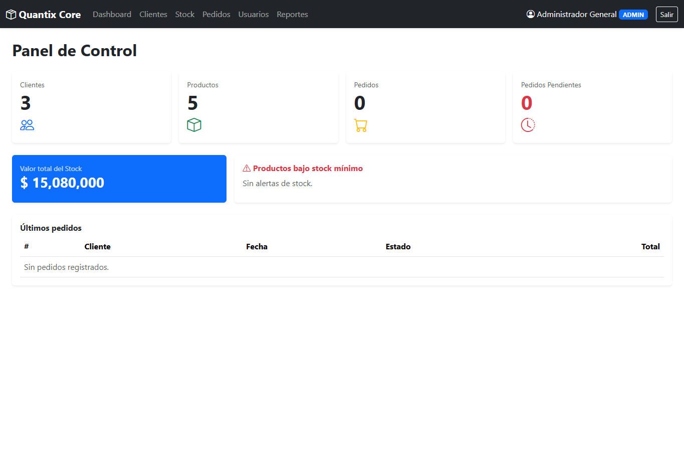
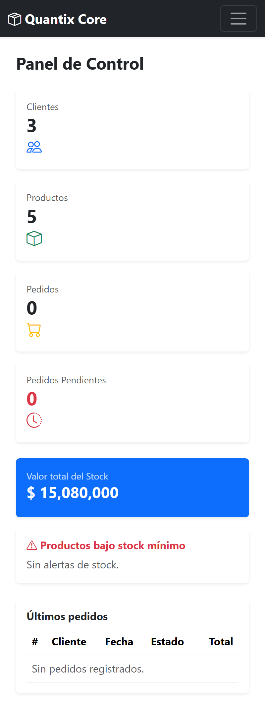

# Quantix Core

**Quantix Core** es un sistema integral de gestión operativa, trazabilidad y control de acceso diseñado para PyMEs y comercios. Desarrollado desde un riguroso relevamiento de procesos y análisis funcional, *Quantix Core* reemplaza planillas de cálculo descentralizadas y propensas a errores por una solución estructurada, segura y con trazabilidad completa de punta a punta.

Con un flujo de trabajo optimizado para la operación diaria, la plataforma centraliza el control de stock en tiempo real, gestión de pedidos, asignación de turnos, facturación y control de acceso basado en roles (RBAC)—eliminando la redundancia de datos y garantizando reportes comerciales confiables.

## 📸 Capturas de pantalla

<div align="center">
  <table>
    <tr>
      <td align="center" valign="bottom" style="padding: 10px;">
        <p><b>Versión de PC</b></p>
        
      </td>
      <td align="center" valign="bottom" style="padding: 10px;">
        <p><b>Versión Móvil</b></p>
        
      </td>
    </tr>
  </table>
</div>

## ✨ Características principales

* **Arquitectura de datos normalizada:** Base de datos relacional modelada en 3FN con integridad referencial estricta, claves foráneas indexadas y triggers para auditoría histórica.

* **Relevamiento funcional documentado:** Incluye especificación formal de requisitos de software (SRS) con casos de uso detallados, diagramas de flujo de procesos (BPMN) y matrices de trazabilidad.

* **Control de acceso basado en roles (RBAC):** Sistema de autenticación y autorización multinivel (Administrador, Operador, Consulta) con hash seguro de contraseñas y permisos granulares por módulo.

* **Trazabilidad total de operaciones:** Bitácora inmutable de auditoría interna que registra usuario, marca de tiempo y estado previo/posterior ante cada modificación crítica de stock o facturación.

* **Control de stock y punto de reposición:** Seguimiento dinámico de existencias, cálculo automático de stock crítico y generación de alertas para reposición de mercadería.

* **Gestión unificada de clientes y pedidos:** Registro de clientes, estados de pedidos (pendiente, en preparación, despachado, cancelado) y vinculación directa con cuentas corrientes.

* **Motor de reportes ejecutivos:** Exportación automatizada a PDF y Excel con métricas de ventas, balance de caja, rotación de inventario y filtros avanzados por fecha o categoría.

* **Diseño ergonómico enfocado en el operador:** Interfaz pensada para carga rápida de datos mediante atajos de teclado, validación de campos en tiempo real y prevención de ingresos duplicados.

## ⚙️ ¿Qué hace? (Módulos del sistema)

Al ingresar a la aplicación con las credenciales correspondientes, el sistema despliega las siguientes áreas según el nivel de acceso:

1. **Autenticación y Seguridad:** Valida identidad contra el catálogo de usuarios, carga el perfil de permisos (RBAC) y abre la sesión con registro en el log de auditoría.

2. **Control de Inventario y Almacén:** Permite altas, bajas, modificaciones y ajustes de stock con motivos justificados, actualizando costos y precios de venta al instante.

3. **Gestión Comercial y Facturación:** Procesa ventas en mostrador, emisión de comprobantes, control de formas de pago y actualización en vivo del saldo del cliente.

4. **Planificación y Turnos:** Administra la agenda de turnos u órdenes de trabajo, evitando superposiciones horarias y notificando disponibilidades.

5. **Reportes y Auditoría:** Genera balances, reportes de rentabilidad y exportaciones estructuradas para el área contable en un solo clic.

## 🛠️ Construido con

* **Lenguaje:** C# 12 / .NET 8 (o Python 3.12)

* **Arquitectura:** Capas desacopladas (Domain, Application, Infrastructure, Presentation) / Patrón MVC-MVVM.

* **Motor de Base de Datos:** PostgreSQL / MariaDB con soporte ACID y transacciones aisladas.

* **Seguridad y Acceso:** Cifrado de credenciales con Argon2id / BCrypt y sesiones gestionadas por tokens/roles.

* **Documentación de Análisis:** Diagramas UML (Casos de Uso, Secuencia), Modelo Entidad-Relación (DER) y plantilla SRS según estándar IEEE 830.

* **Entorno de desarrollo:** Visual Studio Enterprise 2026.

## 🚀 Instalación y uso

1. Cloná el repositorio del proyecto:
   ```bash
   git clone [https://github.com/yurialexanderpagelkruger/quantix-core-erp.git](https://github.com/yurialexanderpagelkruger/quantix-core-erp.git)
   cd quantix-core-erp

## 👨‍💻 Autor

Desarrollado por **Yuri Alexander Pagel Krüger**
